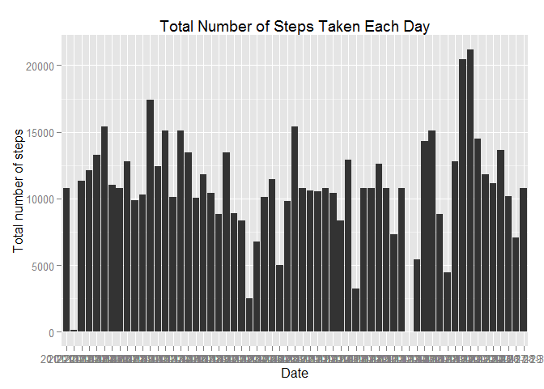

# Reproducible Research: Peer Assessment 1


## Loading and preprocessing the data

```r
dt <- read.csv(file="C:/Users/kexiaobing/Documents/Coursera/Module5-ReproduciableResearch/Project1/activity.csv", header=TRUE, sep=",")
summary(dt)
```

```
##      steps                date          interval     
##  Min.   :  0.00   2012-10-01:  288   Min.   :   0.0  
##  1st Qu.:  0.00   2012-10-02:  288   1st Qu.: 588.8  
##  Median :  0.00   2012-10-03:  288   Median :1177.5  
##  Mean   : 37.38   2012-10-04:  288   Mean   :1177.5  
##  3rd Qu.: 12.00   2012-10-05:  288   3rd Qu.:1766.2  
##  Max.   :806.00   2012-10-06:  288   Max.   :2355.0  
##  NA's   :2304     (Other)   :15840
```

## What is mean total number of steps taken per day?
####1. Make a histogram of the total number of steps taken each day.


```r
##remove NA
noNAdata <- na.omit(dt)
#data <- dt
data <- noNAdata

library(ggplot2)
```

```
## Warning: package 'ggplot2' was built under R version 3.1.2
```

```r
sumData <- aggregate(steps ~ date, data=data, FUN=sum)
ggplot(sumData, aes(date, steps)) + geom_bar(stat = "identity") + labs(title = "Total Number of Steps Taken Each Day", x = "Date", y = "Total number of steps")
```

 

####2. Calculate and report the mean and median total number of steps taken per day.

```r
totalSteps1 <- aggregate(data$steps, list(Date = data$date), FUN = "sum")$x
mean1 <- mean(totalSteps1)
mean1
```

```
## [1] 10766.19
```

```r
median1 <- median(totalSteps1)
median1
```

```
## [1] 10765
```
The mean total number of steps taken per day is 1.0766189\times 10^{4}, the median total number of steps taken per day is 10765

## What is the average daily activity pattern?
####1. Make a time series plot (i.e. type = "l") of the 5-minute interval (x-axis) and the average number of steps taken, averaged across all days (y-axis)

```r
IntData <- aggregate(steps ~ interval, data=data, FUN=mean)
head(IntData)
```

```
##   interval     steps
## 1        0 1.7169811
## 2        5 0.3396226
## 3       10 0.1320755
## 4       15 0.1509434
## 5       20 0.0754717
## 6       25 2.0943396
```

```r
plot(IntData$interval, IntData$steps, type="l", xlab="Interval", ylab="Average Number of steps")
```

 

####2. Which 5-minute interval, on average across all the days in the dataset, contains the maximum number of steps?

```r
maxSteps <- max(IntData$steps)
m <- IntData[IntData$steps == maxSteps, ]
m
```

```
##     interval    steps
## 104      835 206.1698
```
The maximum number of steps is 835, 206.1698113.

## Imputing missing values
####1. Calculate and report the total number of missing values in the dataset (i.e. the total number of rows with NAs).

```r
naData <- dt[is.na(dt$steps), ]
s <- nrow(naData)
s
```

```
## [1] 2304
```
The total number of missing values in the dataset is 2304.

####2. Devise a strategy for filling in all of the missing values in the dataset.  
My strategy is to use the mean for that 5-minute interval to fill in all of the missing values in the dataset.


####3. Create a new dataset that is equal to the original dataset but with the missing data filled in.

```r
dt2 <- dt 
for (i in 1:nrow(dt2)) {
    if (is.na(dt2$steps[i])) {
        dt2$steps[i] <- IntData[which(dt2$interval[i] == IntData$interval), ]$steps
    }
}
head(dt2)
```

```
##       steps       date interval
## 1 1.7169811 2012-10-01        0
## 2 0.3396226 2012-10-01        5
## 3 0.1320755 2012-10-01       10
## 4 0.1509434 2012-10-01       15
## 5 0.0754717 2012-10-01       20
## 6 2.0943396 2012-10-01       25
```

####4. Make a histogram of the total number of steps taken each day.  

```r
sumData2 <- aggregate(steps ~ date, data=dt2, FUN=sum)
head(sumData2)
```

```
##         date    steps
## 1 2012-10-01 10766.19
## 2 2012-10-02   126.00
## 3 2012-10-03 11352.00
## 4 2012-10-04 12116.00
## 5 2012-10-05 13294.00
## 6 2012-10-06 15420.00
```

```r
ggplot(sumData2, aes(date, steps)) + geom_bar(stat = "identity") + labs(title = "Total Number of Steps Taken Each Day", x = "Date", y = "Total number of steps")
```

 

Calculate and report the mean and median total number of steps taken per day.

```r
totalSteps2 <- aggregate(dt2$steps, list(Date = dt2$date), FUN = "sum")$x
mean2 <- mean(totalSteps2)
mean2
```

```
## [1] 10766.19
```

```r
median2 <- median(totalSteps2)
median2
```

```
## [1] 10766.19
```
  
####Do these values differ from the estimates from the first part of the assignment? 
The difference of total average number of steps taken is 0.
The difference of total median number of steps taken is 1.1886792.


####What is the impact of imputing missing data on the estimates of the total daily number of steps?  
After imputing missing data the median total number of steps taken has no change, while the mean total number of steps taken has increased.

## Are there differences in activity patterns between weekdays and weekends?  
####1. Create a new factor variable in the dataset with two levels - "weekday" and "weekend" indicating whether a given date is a weekday or weekend day.

```r
dt3 <- dt2
dt3$weekday <- factor(format(as.Date(dt2$date), "%A"))
levels(dt3$weekday) <- list(weekday = c("Monday", "Tuesday", "Wednesday", "Thursday", "Friday"),
                        weekend = c("Saturday", "Sunday"))

summary(dt3)
```

```
##      steps                date          interval         weekday     
##  Min.   :  0.00   2012-10-01:  288   Min.   :   0.0   weekday:12960  
##  1st Qu.:  0.00   2012-10-02:  288   1st Qu.: 588.8   weekend: 4608  
##  Median :  0.00   2012-10-03:  288   Median :1177.5                  
##  Mean   : 37.38   2012-10-04:  288   Mean   :1177.5                  
##  3rd Qu.: 27.00   2012-10-05:  288   3rd Qu.:1766.2                  
##  Max.   :806.00   2012-10-06:  288   Max.   :2355.0                  
##                   (Other)   :15840
```

####2. Make a panel plot containing a time series plot (i.e. type = "l") of the 5-minute interval (x-axis) and the average number of steps taken, averaged across all weekday days or weekend days (y-axis).  

```r
meanSteps <- aggregate(dt3$steps, 
                      list(interval = as.numeric(as.character(dt3$interval)), 
                           weekday = dt3$weekday),
                      FUN = "mean")
names(meanSteps)[3] = "avgSteps"
head(meanSteps)
```

```
##   interval weekday   avgSteps
## 1        0 weekday 2.25115304
## 2        5 weekday 0.44528302
## 3       10 weekday 0.17316562
## 4       15 weekday 0.19790356
## 5       20 weekday 0.09895178
## 6       25 weekday 1.59035639
```

```r
library(lattice)
xyplot(meanSteps$avgSteps ~ meanSteps$interval | meanSteps$weekday, 
       layout=c(1,2), type="l",
       xlab="Interval", ylab="Number of steps")
```

 
